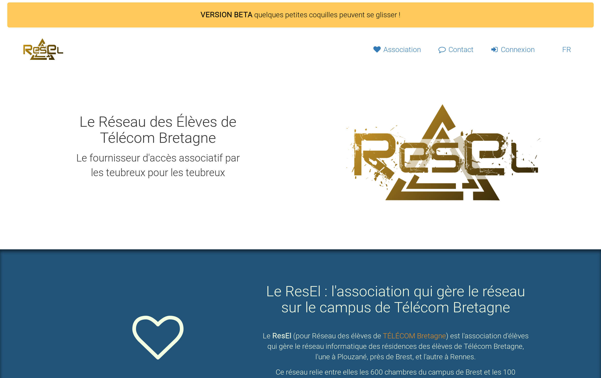

Le site resel.fr
================

[](https://git.resel.fr/resel/myresel/commits/master)
[](https://git.resel.fr/resel/myresel/commits/master)


Ceci est le code pour le nouveau site ResEl [resel.fr](resel.fr) il est développé en [Python](https://python.org) avec le framework [Django](https://www.djangoproject.com/). Ce document a pour objectif de vous présenter rapidement le projet et son fonctionnement. Il sert également de guide pour les nouveaux développeurs qui veulent contribuer au projet et de guide pour les administrateurs systèmes qui voudraient installer (ou réparer) le service.

Dans la suite du document nous supposons que le lecteur est famillier avec [Python](https://python.org) et avec le framework [Django](https://www.djangoproject.com/) (et toutes les technologies associées HTTP, MYSQL, HTML, CSS, Javascript).



# Sommaire
 - [Démarrage en 2 minutes](#démarrage-en-2-minutes)
 - [Liste des modules](#liste-des-modules)
   - [Modules](#modules)
   - [Autres dossiers](#autres-dossiers)
 - [Documentation](#documentation)
 - [Notes](#notes)
 - [Astuces](#astuces)
 - [Crédits](#crédits)
   
# Démarrage en 2 minutes
Cette démarche vous permettra d'avoir un serveur de développement prêt à être utilisé en créant et en populant les bases de données (MYSQL, LDAP) automatiquement. Nous utilisons Vagrant qui permet de faire tout cela automagiquement.

Installer [Vagrant](https://www.vagrantup.com/)
```
sudo apt install vagrant  # On a Debian-based distribution
```

Installer l'environement de développement :
````
git clone https://git.resel.fr/resel/myresel
cd myresel/
vagrant up  # It might take a while, thanks to the LaTeX environment :p
````

Démarrer le serveur :
````
vagrant ssh
cd /myresel
python3 manage.py rqworker default &
python3 manage.py runserver 0.0.0.0:8000
````

Sur votre navigateur web rendez-vous sur :
 - `http://10.0.3.94:8000` Pour simuler le VLAN 994 (depuis l'extérieur)
 - `http://10.0.3.95:8000` Pour simuler le VLAN 995 (depuis le réseau d'inscription)
 - `http://10.0.3.99:8000` Pour simuler le VLAN 999 (Depuis une machine inscrite)
 - `http://10.0.3.199:8000` Pour simuler le VLAN 999 (Depuis une machine non inscrite)

Votre adresse MAC sera par défaut : "0a:00:27:00:00:10", Vous pouvez la changer dans le fichier `myresel/settings_local.py`.


# Documentation
La documentation complete est disponible dans le dossier [/doc](doc/README.md).  
N'hésitez pas à la lire avant de contribuer au projet.
 
# Zone d'inscription

Du fait de l'architecture très spécialisée du ResEl, toute les fonctionnalités touchants à l'inscription et la gestion des machines sont sensibles. En effet, pour détecter la bonne addresse MAC et pour proposer un site différent dépendant de l'origine de l'utilisateur, il est nécéssaire de mettre la machine sur plusieurs réseaux.  

Dépendant du VLAN d'origine, le serveur NGINX taggera les requêtes HTTP différement. Puis, en fonction du tag les middlewares `NetworkConfiguration` et `inscriptionNetworkHandler` ajouterons des métadonnées aux requetes (comme par exemple l'adresse mac de l'utilisateur) puis vont rerouter les requêtes vers les bonnes vues.

Dans l'environnement de développement, comme il est extrêmement compliqué de totalement simuler l'architecture du ResEl, le choix a été fait de créer un nouveau middleware `SimulateProductionNetwork` qui empoisonera les requetes avec de fausses ip.


# Astuces

## mettre le site en mode maintenance
Lorsque vous avez de grosses migrations à faire, il est parfois nécéssaire de mettre le site en mode maintenance pour éviter que les utilisateurs ecrivent dans la base de données en même temps que vos migrations. Pour cela il suffit de renommer le fichier `maintenance_off.html` en `maintenance_on.html`. Si la configuration de nginx est correcte, le site devrait retourner une erreur `503` le temps de faire la migration. 

-----------------------

# Crédits
Pour ce magnifique site, on peut remercier : 
 - Théo Jacquin @nimag42 : theo.jacquin@telecom-bretagne.eu
 - Morgan Robin @tharkunn : morgan.robin@telecom-bretagne.eu
 - Loïc Carr @dimtion : loic.carr@telecom-bretagne.eu

Code sous license ne faites pas de bêtises.