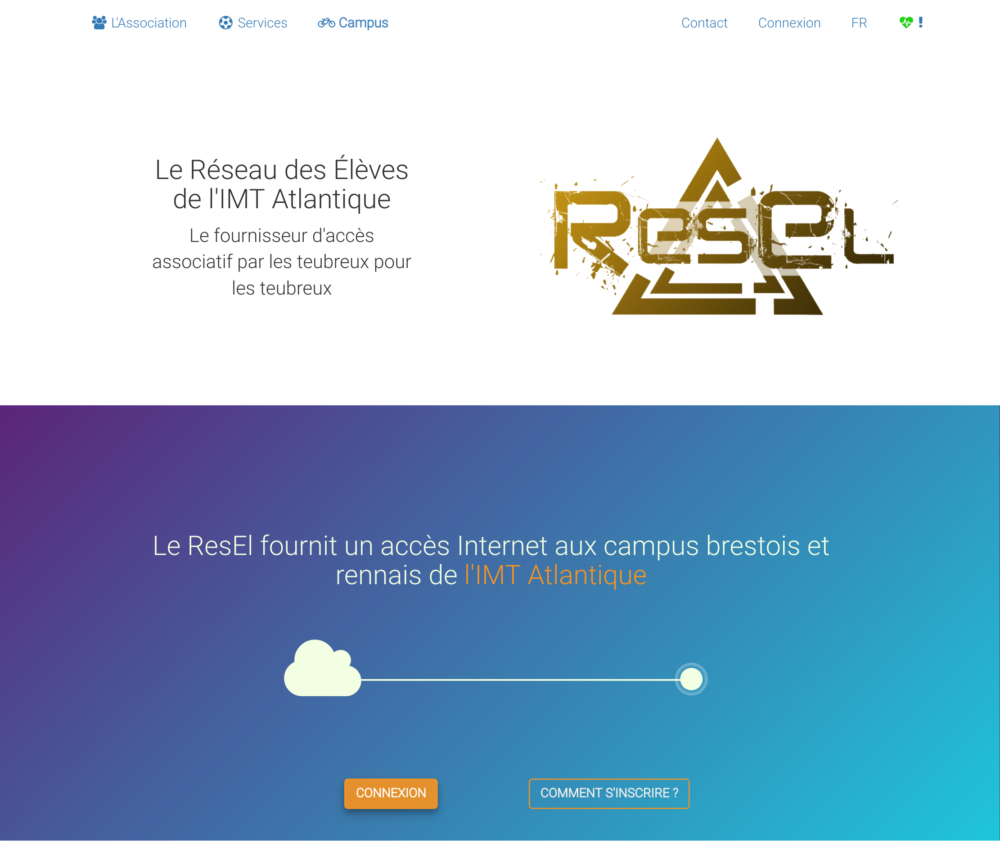

resel.fr
========

Ceci est le code pour le nouveau site ResEl  resel.fr il est développé en [Python](https://python.org) avec le framework [Django](https://www.djangoproject.com/). 



## Démarrage en 2 minutes
Cette démarche vous permettra d'avoir un serveur de développement prêt à être utilisé en créant et en populant les bases de données (mysql, ldap) automatiquement.

Installer [Vagrant](https://www.vagrantup.com/)
```
sudo apt install vagrant  # On a Debian installation
```

Installer l'environement de developpement :
````
git clone https://git.resel.fr/resel/myresel
cd myresel/
vagrant up  # It might take a while, thanks to the LaTeX environment :p
````

Démarer le serveur :
````
vagrant ssh
cd /myresel
python3 manage.py rqworker default &
python3 manage.py runserver 0.0.0.0:8000
````

Sur votre navigateur allez sur :
 - `http://10.0.3.94:8000` Pour simuler le VLAN 994 (depuis l'exterieur)
 - `http://10.0.3.95:8000` Pour simuler le VLAN 995 (depuis le réseau d'inscription)
 - `http://10.0.3.99:8000` Pour simuler le VLAN 999 (Depuis une machine inscrite)
 - `http://10.0.3.199:8000` Pour simuler le VLAN 999 (Depuis une machine non inscrite)

Votre adresse MAC sera par défaut : "0a:00:27:00:00:10", Vous pouvez la changer dans le fichier `myresel/settings_local.py`.


### Tests
En plus des tests "manuels", l'application présente des tests automatisé qui permettent de vérifier le bon fonctionnement des parties critiques de l'application. Quand vous ajoutez du code, **créez des tests** ! [En plus c'est très simple avec Django...](https://docs.djangoproject.com/en/1.10/topics/testing/)


Pour lancer les tests :
```
python3 manage.py tests
```

**Ne lancez surtout pas les tests sur le ldap de production !** Vous risquez d'avoir des surprises.

## Liste des modules et fonctionnalités

### Modules 
 - `myresel/` : contient l'ensemble des fichier de configuration de l'application. Le fichier `settings.py` contient la configuration indépendante de l'installation et le fichier `settings_local.py` contient la configuration qui dépend de l'installation.
 - `ldapback/` : Wrapper vers le backend ldap qui simule les models django. Voir `ldapback/README.md` pour plus d'informations
 - `fonctions/` : des fonctions génériques utiles (en cours de depreciation)
 - `gestion_personnes/` : tout ce qui touche à la gestion des comptes utilisateurs
 - `gestion_machines/` :  tout ce qui touche à la gestion des machines (inscription...)
 - `tresorerie/` : la tréso
 - `clubs/` : Gestion des clubs
 - `whoswho/` : La gestion de l'annuaire
 - `wiki/` :  le Wiki destiné aux utilisateurs. Actuellement il est éditable uniquement par les administrateurs.
 - `pages/` : les pages statiques
 
### Autres dossiers
 
 - `locale/` : les fichiers de langue
 - `static/` : les fichiers statiques (js, img, css...)
 - `templates/` : les templates généraux à l'application 
 - `vagrant/` : les fichiers de configuration spécifiques à Vagrant
 
 
 ## Conventions et bonnes pratiques 
 
 Ici, on a des nazis du [PEP8](https://www.python.org/dev/peps/pep-0008/), donc respectez le. Si vous n'aimez pas lire les trucs compliqués [voici un petit résumé](http://sametmax.com/le-pep8-en-resume/).
 
 Le nom des entités (modules, fonctions, classes, variables...) doit toujours être en anglais, pour les commentaires et les docstrings on est plus souple et le français est toléré. Vous constaterez que ceci n'est pas toujours respecté, c'est pas une raison pour continuer rajouter du français dans le code !
 
 Toutes les fonctions et classes doivent avoir un docstring sauf quand le code est vraiment évident. Aussi, un bon commentaire n'explique ce que fait le code, mais pourquoi ce bout de code existe.
 
 